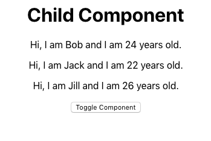
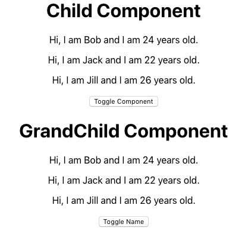
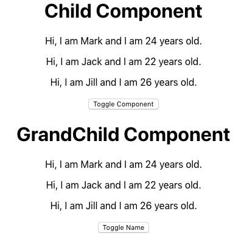

Hi and welcome back to part 2 of the React context API series. For part one, we talked about how to leverage React's context API to pass state values to child components. Now, in part 2, we're gonna look at how do we update the state through Consumers?

<figure>
    
    <figcaption style="text-align: center; font-weight: 600"><br>Photo by Émile Perron on Unsplash</figcaption>
</figure>

The repo for this project can be found <a href="https://github.com/arevaldez/Context-Tutorial-Pt2" target="_blank">here.</a>

If you want to learn more about what context is I highly suggest reading my [first post](../react-context-api-passing-state-to-child-components-made-easy). I explain a little more about why context is useful as well.

## What you will make

Let's take a look at what you'll make. Check out the picture below.

<figure>
    
    <figcaption style="text-align: center; font-weight: 600"><br>Child Component</figcaption>
</figure>

Does this look familiar? It's the same Child component from part one! _But wait... There's a button?_ Why, yes. Yes there is. Let's see what it does!

<figure>
    
    <figcaption style="text-align: center; font-weight: 600"><br>Toggled Grandchild Component</figcaption>
</figure>

Awesome. We are now able to toggle the Grandchild component. We'll see how to do that later. _But wait... There's **another** button._ Why, yes. Yes there is. Can you guess what this button does?

<figure>
    
    <figcaption style="text-align: center; font-weight: 600"><br>Toggled Name</figcaption>
</figure>

If you guessed that it toggled a name, you would be correct. It toggles the first name of each component between _**Bob**_ and _**Mark**_. Guess what? This is _all_ done through context! Let's take a look how.

## Tutorial

**Create the context**. First, Let's create a Context.js file again that will create the Provider and Consumer that we need.

```jsx
import { createContext } from "react"

const { Provider, Consumer } = createContext()

export { Provider, Consumer }
```

<br>

Import _createContext_ from react. This let's us create our Context object. Then, create the _Provider_ and _Consumer_.

```jsx
const { Provider, Consumer } = createContext()
```

<br>

Just a quick reminder. This step is **important**. Creating the Provider and Consumer is what allows us to subscribe to state changes outside of the Parent component that holds the state.

**The Parent**. Okay, so we've created our context object. We've created the Provider and the Consumer. Let's create the _Parent_ component that will hold the state.

```jsx
import React, { Component } from "react"
import Child from "./Child"
import { Provider } from "./Context"

class Parent extends Component {
  state = {
    toggleGrandChild: false,
    toggleName: false,
    people: [
      { id: 0, name: "Bob", age: 24 },
      { id: 1, name: "Jack", age: 22 },
      { id: 2, name: "Jill", age: 26 },
    ],
  }

  toggleComponent = () => {
    this.setState({
      toggleGrandChild: !this.state.toggleGrandChild,
    })
  }

  switchNameHandler = newName => {
    this.setState({
      toggleName: !this.state.toggleName,
      people: [
        { id: 0, name: newName, age: 24 },
        { id: 1, name: "Jack", age: 22 },
        { id: 2, name: "Jill", age: 26 },
      ],
    })
  }

  render() {
    return (
      <Provider
        value={{
          state: this.state,
          toggleComponent: this.toggleComponent,
          switchNameHandler: e => this.switchNameHandler(e),
        }}
      >
        <Child />
      </Provider>
    )
  }
}

export default Parent
```

<br>

Okay, there's a lot going on here. Let's take a look at the state items first.

```jsx
state = {
  toggleGrandChild: false,
  toggleName: false,
  people: [
    { id: 0, name: "Bob", age: 24 },
    { id: 1, name: "Jack", age: 22 },
    { id: 2, name: "Jill", age: 26 },
  ],
}
```

<br>

The first item is `toggleGrandChild`. This let's us know if the GrandChild compenent is toggled or not. The value starts off as false. Here's the function that changes the state.

```jsx
toggleComponent = () => {
  this.setState({
    toggleGrandChild: !this.state.toggleGrandChild,
  })
}
```

<br>

`toggleComponent` changes the state of `toggleGrandChild` to the opposite of its current value. So, if its current value is false and the `toggleComponent` is called, then the value will change to true. This function will serve to toggle the GrandChild component.

Next, we have the `toggleName` state value. You guessed it. It is used to toggle the name. `toggleName` also starts at the value of false. Let's look at its corresponding function.

```jsx
switchNameHandler = newName => {
  this.setState({
    toggleName: !this.state.toggleName,
    people: [
      { id: 0, name: newName, age: 24 },
      { id: 1, name: "Jack", age: 22 },
      { id: 2, name: "Jill", age: 26 },
    ],
  })
}
```

  <br>

A `newName` is being passed into the `switchNameHandler`. This handler handles changing the name of the first person. First, it toggles the `toggleName` value. Next, it inserts the new name into the name value of the first people object. Notice that the other names stay the same. This is to show that the other people objects will remain the same. Technically though, you are updating the objects with the same initial values.

Lastly, we have the people object. People holds the object of each person. `Bob` is the name that gets switched later on.

```jsx
people: [
  { id: 0, name: "Bob", age: 24 },
  { id: 1, name: "Jack", age: 22 },
  { id: 2, name: "Jill", age: 26 },
]
```

<br>

**The Provider**. Let's move into the Provider. Remember, the Provider will wrap components that contain consumers.

```jsx{8}
<Provider
    value={{
        state: this.state,
        toggleComponent: this.toggleComponent,
        switchNameHandler: e => this.switchNameHandler(e)
    }}
>
    <Child />
</Provider>
);
```

<br>

In this case, the component that is wrapped is the Child component. The Child component also contains the GrandChild component within it. More on that later.

Let's look at the `value` within the Provider.

```jsx
value={{
    state: this.state,
    toggleComponent: this.toggleComponent,
    switchNameHandler: e => this.switchNameHandler(e)
}}
```

<br>

This looks familiar. However, it's a little different than part one of the tutorial. The original Provider value from part one looked like this.

```jsx
value={this.state}
```

<br>

_So why is this one different?_ We talked a little about it in part one but let's look at it again. If we want to pass in a function to our context Consumers, we have to pass in variables that contain the functions needed. This is why we have items like `switchNameHandler: e => this.switchNameHandler(e)`. Let's look at the Child component to see how we utilize this.

**The Child Component**

```jsx
import React from "react"
import { Consumer } from "./Context"
import GrandChild from "./GrandChild"

function Child() {
  return (
    <Consumer>
      {context => (
        <div>
          <h1>Child Component</h1>
          {context.state.people.map(person => {
            return (
              <p key={person.id}>
                Hi, I am {person.name} and I am {person.age} years old.
              </p>
            )
          })}
          <button onClick={() => context.toggleComponent()}>
            Toggle Component
          </button>

          {context.state.toggleGrandChild ? <GrandChild /> : null}
        </div>
      )}
    </Consumer>
  )
}

export default Child
```

<br>

Notice, once again, the entire component is wrapped with the Consumer context object. Within the Consumer is `{context => (...)}`. This connects the items in the consumer to the `value= ...` items from the Provider. This is because the Consumer has subscribed to the values in the Provider. **Note: 'context' is an arbitrary name that could be any name. It does NOT have to be 'context'.**

Let's look at the Consumer.

```jsx
<Consumer>
  {context => (
    <div>
      <h1>Child Component</h1>
      {context.state.people.map(person => {
        return (
          <p key={person.id}>
            Hi, I am {person.name} and I am {person.age} years old.
          </p>
        )
      })}
      <button onClick={() => context.toggleComponent()}>
        Toggle Component
      </button>

      {context.state.toggleGrandChild ? <GrandChild /> : null}
    </div>
  )}
</Consumer>
```

<br>

First, we map through the people object that is contained in the state of the Parent component. _How do we access people?_ Easy. We use `context.state.people`. Remember in the Parent component value we set `state: this.state`? That's why we have access to `context.state`. If we wrote `context.state.toggleGrandChild` then we would have access to the `toggleGrandChild` state value.

Back to mapping through the people object. We map through the object just like part one and return `Hi, I am {person.name} and I am {person.age} years old.` But, now there is a button below it. Let's take a look.

```jsx
<button onClick={() => context.toggleComponent()}>Toggle Component</button>
```

<br>

Can you guess what this does? It calls the function `toggleComponent` that is in the Parent component. Remember what this function does?

```jsx
toggleComponent = () => {
  this.setState({
    toggleGrandChild: !this.state.toggleGrandChild,
  })
}
```

<br>

It toggles the state value of `toggleGrandChild`. Let's look a little bit below the button.

```jsx
context.state.toggleGrandChild ?<GrandChild /> : null}
```

<br>

If this looks unfamiliar to you, don't worry. It's just a fancy shorthand way of writing an if else statement. It could easily be written like this.

```jsx
if context.state.toggleGrandChild === true {
    <GrandChild />
} else {
    null
}
```

<br>

The shorthand notation just saves some space but the standard if else statement will work just fine.

So, what is this part doing? It's grabbing the value of `toggleGrandChild` from the Parent Component state. If the value is true, then it will render the GrandChild component. If the value is false, it will render nothing.

When you press the button, it will call the `toggleComponent` function in the Parent component. This is because you passed `toggleComponent: this.toggleComponent` in the value section of the Provider in the Parent component. What does that function do again? Oh, right. It changes the value of `toggleGrandChild`. Wow! That's amazing. You just changed the state from a Child component. Congrats, my friend.

**GrandChild Component**. Okay, we are on the home stretch. We've already learned how to update the state through our Child component. But, we've just toggled a value true or false. That's not very fun or exciting. Let's move on to updating a string value. First, we'll look at the GrandChild component.

```jsx
import React from "react"
import { Consumer } from "./Context"

function GrandChild() {
  return (
    <Consumer>
      {context => (
        <div>
          <h1>Grandchild Component</h1>
          {context.state.people.map(person => {
            return (
              <p key={person.id}>
                Hi, I am {person.name} and I am {person.age} years old.
              </p>
            )
          })}

          <button
            onClick={
              context.state.toggleName
                ? e => context.switchNameHandler("Bob")
                : e => context.switchNameHandler("Mark")
            }
          >
            Toggle Name
          </button>
        </div>
      )}
    </Consumer>
  )
}

export default GrandChild
```

<br>

There's a lot going on in this component as well. At first glance, it looks pretty similar to the Child component. It's mapping through the people object and printing the same `Hi, I am {person.name} and I am {person.age} years old.`. And there's a button. But, the button seems to be doing something different? Let's take a look.

```jsx
<button
  onClick={
    context.state.toggleName
      ? e => context.switchNameHandler("Bob")
      : e => context.switchNameHandler("Mark")
  }
>
  Toggle Name
</button>
```

<br>

Now, instead of just calling a function to toggle true or false, we're actually passing a value to a function. Let's look back at the `switchNameHandler` that was passed as a value in the Provider of the Parent Componenent.

```jsx
value={{
    state: this.state,
    toggleComponent: this.toggleComponent,
    switchNameHandler: e => this.switchNameHandler(e)
}}
```

<br>

So, we assigned the value `switchNameHandler` to `e => this.switchNameHandler(e)`. This let's us use `context.switchNameHandler({value})` within a context Consumer. Currently, we're passing a name. Let's look at the `switchNameHandler` function again.

```jsx
switchNameHandler = newName => {
  this.setState({
    toggleName: !this.state.toggleName,
    people: [
      { id: 0, name: newName, age: 24 },
      { id: 1, name: "Jack", age: 22 },
      { id: 2, name: "Jill", age: 26 },
    ],
  })
}
```

<br>

First, we're toggling the value of toggleName to either true or false. Next, we are assigning the id, name, and age to each people object again. But, this time, for the first people object we are passing in the value `newName`. This is the value that is passed from the function. Let's jump back to the GrandChild component where we call this function.

```jsx
onClick={
    context.state.toggleName
        ? e => context.switchNameHandler("Bob")
        : e => context.switchNameHandler("Mark")
}
```

<br>

Remember, this is just a fancy if else statement. It could easily be written like this.

```jsx
if context.state.toggleName === true {
    e => context.switchNameHandler("Bob")
} else {
    e => context.switchNameHandler("Mark")
}
```

<br>

This checks the value of `toggleName` from the state within the Parent Component. If it is true, then it will pass `Bob` to the `switchNameHandler` function. This then updates the name of the first people object to `Bob`. Then, it will update the `toggleName` to false. Notice, if you press the `Toggle Component` button, it will still toggle the GrandChild component. But, it does not change the state value for `toggleName`. So, the name will stay regardless of the GrandChild component being visible or not.

## Conclusion

So, we've learned how to use React's context API not only to read the state of a Parent component from a Child component, but also to update the state of the Parent from a Child. The Consumers within the Child components subscribe to the values being passed from the Provider within the Parent component. Now you can leverage context to read and update the state. Go make something great!
