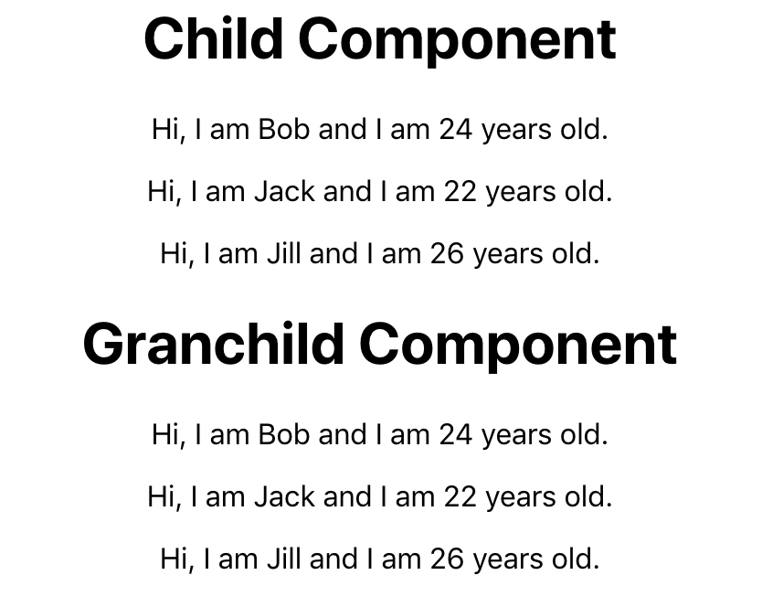

So, you've heard about React's context API but are scared to approach it because of the complexity of Redux. Well, my friend, this is a simple tutorial to get you started with the beauty that is context.

<figure>
    
    <figcaption style><br>Photo by Oskar Yildez on Unsplash</figcaption>
</figure>

If you just want the example, skip to the [example](#example) section. You can also find the code <a href="https://github.com/arevaldez/simple-context-app" target="_blank">here.</a>

## What is context?

React's context API was built to allow passing data to components easier. This could be done by a method called prop drilling. <a href="https://kentcdodds.com/blog/prop-drilling" target="_blank">Here</a> is a really good article about prop drilling by Kent C. Dodds. Prop drilling is still a good method, but, it is not very practical for a larger application.

Many have also turned to a tool called <a href="https://redux.js.org/" target="_blank">Redux</a>. Redux is awesome and the implementation is very similar to how you would use context. Unfortunately, the learning curve is pretty steep and, for most applications, Redux is just overkill.

So, back to _What is context?_ Context allows passing state data within an application to be made simple. State data is passed down from the parent to child within the component tree via a _Provider_. Each child component can have a _Consumer_ that will subscribe to the state changes from the parent component. Now that is awesome. A functional child component can subscribe to the parent's state.

## Why is context useful?

Context allows for data to be shared as _global_ data within a component tree. This makes code much more readable. A child component directly subscribes to the top component state no matter where the child component lies within the component tree.

Remember prop drilling? Well, as component trees get bigger and bigger, the layers that the top state have to drill through becomes quite complex. It is often hard to find where in the component tree contains a bug. With context, each child component is simply subscribing to the top layer state. Forwarding props through layers does not become an issue in this case.

<a name="example"></a>

## Simple Example

_Where's the example already?_ Don't worry. It's coming up next!

**What you will make:**

<figure>
    
    <figcaption ><br>Context Example</figcaption>
</figure>

The child component is the first component that receives the state from the context provider. It then procedes to pass the state down to the grandchild. Lets take a look.

**Create the context.** Let's create a Context.js file. It will create the Provider and Consumer for us.

```jsx
import { createContext } from "react"

const { Provider, Consumer } = createContext()

export { Provider, Consumer }
```

<br/>

First, we need to import _createContext_ from react. This will allow us to create our Context object. Then, we'll create the _Provider_ and _Consumer_. **This is important.** The Provider will provide (no pun intended... well, kind of) the state to the Consumer. Each Consumer will subscribe to updates from the Provider.

**The Parent.** Next, we'll create the _Parent_ component. This component will contain the Provider and the state.

```jsx
import React, { Component } from "react"
import { Provider } from "./Context"
import Child from "./Child"
class Parent extends Component {
  state = {
    people: [
      { id: 0, name: "Bob", age: 24 },
      { id: 1, name: "Jack", age: 22 },
      { id: 2, name: "Jill", age: 26 },
    ],
  }

  render() {
    return (
      <Provider value={this.state}>
        <Child />
      </Provider>
    )
  }
}

export default Parent
```

<br/>

The _state_ is declared as _people_. People has three items. The _Provider_ context object is then wrapped around a _Child_ component. Pay attention to the provider.

```jsx
<Provider value={this.state}>
  <Child />
</Provider>
```

<br/>

Within the Provider component, value is set to _{this.state}_. Within the _Child_ component, there is a _Consumer_ that will subscribe to the value given by Provider. In this case that value is the state. **NOTE: The Provider ALWAYS has to wrap a Consumer. It will not work if components with Consumers do not have a Provider.**

**The Child.** Next, we'll create the _Child_ component.

```jsx
import React from "react"
import { Consumer } from "./Context"
import Grandchild from "./GrandChild"

function Child() {
  return (
    <Consumer>
      {context => (
        <div>
          <h1>Child Component</h1>
          {context.people.map(person => {
            return (
              <p key={person.id}>
                Hi, I am {person.name} and I am {person.age} years old.
              </p>
            )
          })}

          <GrandChild />
        </div>
      )}
    </Consumer>
  )
}

export default Child
```

<br/>

Okay, there's quite a bit going on. Lets break it down. First, the _Consumer_ context object is imported. Next, the entire component is wrapped by the Consumer context object.

```jsx
<Consumer>
  {context => (
    <div>
      <h1>Child Component</h1>
      {context.people.map(person => {
        return (
          <p key={person.id}>
            Hi, I am {person.name} and I am {person.age} years old.
          </p>
        )
      })}

      <GrandChild />
    </div>
  )}
</Consumer>
```

<br/>

Within Consumer is _{context => ( ... )}_. Remember the _value=this.state_ from the provider? Well, context within the Consumer is directly connected to the value. This is because it has subscribed to it. Right before the closing _div_ is the _**GrandChild**_ component. Lets take a look. **NOTE: 'context' is an arbitrary name. It could be data, dog, blah, etc.**

```jsx
import React from "react"
import { Consumer } from "./Context"

function GrandChild() {
  return (
    <Consumer>
      {context => (
        <div>
          <h1>Granchild Component</h1>
          {context.people.map(person => {
            return (
              <p key={person.id}>
                Hi, I am {person.name} and I am {person.age} years old.
              </p>
            )
          })}
        </div>
      )}
    </Consumer>
  )
}

export default GrandChild
```

<br/>

**The GrandChild.** Hmm... Looks familiar. It's pretty much the same as the _Child_ component as far as functionality. The entire component is still wrapped with _Consumer_. This allows the state from the _Parent_ to be passed down.

```jsx
<Provider value={this.state}>
  <Child />
</Provider>
```

<br/>

Remember this? This is in the Parent component. The Provider wraps around _**Child**_. Within Child is _**GrandChild**_. This means that the GrandChild has access to subscribe to the value given by the Provider. That is why it is able to access the state.

_But, what if I don't want to nest them? What if I want two components to have access to the parent state?_ No Problem. Check out the code below.

```jsx
<Provider value={this.state}>
  <ComponentOne />
  <ComponentTwo />
</Provider>
```

<br/>

Then, simply wrap the contents within each component with a Consumer and you're all set.

## Conclusion

So, we've learned how to use React's context API with a simple app. State from the Parent is passed down to children via a Provider. Consumers are used within the children to _subscribe_ to the value passed in the Provider. Not so bad right? Stay tuned for part 2 where I'll show you how to update the state of the parent with a Consumer.

### Resources

- <a href="https://github.com/arevaldez/simple-context-app" target="_blank">My Repository</a>
- <a href="https://kentcdodds.com/blog/prop-drilling" target="_blank">Prop Drilling by Kent C. Dodds</a>
- <a href="https://redux.js.org/" target="_blank">Redux Documentation</a>
